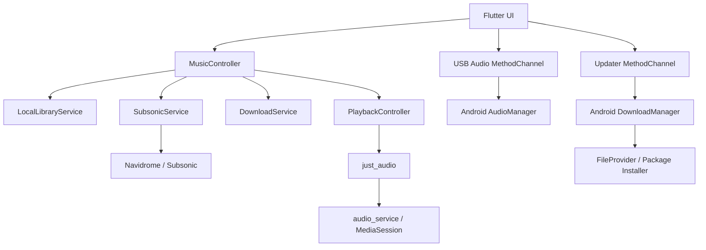

# Liquid Music for Android

[](https://flutter.dev/)
[](https://developer.android.com/)
[](LICENSE)
[](https://github.com/admin0330/real-liquid-glass-android-demo/releases)

Liquid Music 是一个面向 Android 的开源无损音乐播放器。它支持本地 FLAC 等音频、Navidrome / Subsonic 第三方音乐源、离线下载、同步歌词、后台媒体控制、USB DAC 独占模式以及应用内更新。

界面采用 iOS 26 启发的内容层与 Liquid Glass 控制层结构：音乐内容保持清晰，Dock、迷你播放器、搜索与顶部操作浮在内容之上。项目使用 [`real_liquid_glass`](https://pub.dev/packages/real_liquid_glass) 并针对 Android 做了性能与交互适配。

> [!IMPORTANT]
> 本项目不是 Apple、Apple Music、Telegram 或 Bunpod 的官方产品，也不提供商业音乐服务抓取、付费内容破解、DRM 绕过或未经授权的音乐源。请只播放你拥有或获授权使用的内容。

## 目录

- [主要功能](#主要功能)
- [界面与交互](#界面与交互)
- [系统要求](#系统要求)
- [技术架构](#技术架构)
- [项目结构](#项目结构)
- [快速开始](#快速开始)
- [本地与第三方音乐源](#本地与第三方音乐源)
- [USB DAC 独占模式](#usb-dac-独占模式)
- [应用内更新](#应用内更新)
- [Release 签名](#release-签名)
- [GitHub Actions 发布](#github-actions-发布)
- [阿里云镜像部署](#阿里云镜像部署)
- [权限与隐私](#权限与隐私)
- [测试](#测试)
- [已知限制](#已知限制)
- [常见问题](#常见问题)
- [许可证](#许可证)

## 主要功能

### 无损与本地播放

- 导入 FLAC、ALAC / M4A、WAV、AIFF、APE、OGG、Opus、AAC 和 MP3。
- 读取标题、艺人、专辑、封面、时长、码率、采样率、位深和内嵌歌词。
- 保留本地原始文件，不主动转码。
- 显示无损格式与音频质量信息。
- 支持收藏、个人歌单、播放队列、随机播放和循环模式。

### 第三方音乐源

- 连接 Navidrome、Subsonic 和兼容 OpenSubsonic 的自建服务器。
- 浏览远程专辑、歌曲、歌单与收藏。
- 请求服务器返回原始音频格式。
- 将远程音频保存到本地离线播放。
- 使用 Subsonic 随机盐令牌认证，密码保存在 Android 安全存储中。

### 播放体验

- Android 后台播放。
- 通知栏、锁屏、耳机、蓝牙设备和车机媒体控制。
- Apple Music 风格的大号播放 / 暂停控制。
- 独立播放器页面、专辑详情、队列和迷你播放器。
- 播放器使用 GPU 位移过渡，返回时不执行整屏实时模糊。

### 歌词

- 支持 LRC 时间轴歌词与内嵌歌词。
- 逐行高亮、非活动行模糊和自动滚动。
- 点击“歌词”进入沉浸式纯歌词页面。
- 从页面顶部向下拖动可关闭歌词页面。

### 更新

- 应用内检查、下载和安装 APK。
- 支持 GitHub Releases 与自定义 `latest.json` 镜像。
- 优先使用阿里云 / 自建镜像，GitHub 作为回退。
- 校验 APK 包名、版本、文件大小与 SHA-256。
- 同版本安装包持久缓存，安装失败后无需重复下载。
- HTTP Range 断点续传。

## 界面与交互

界面遵循以下层级：

1. **内容层**：专辑封面、歌曲、设置与歌单使用清晰的系统材质。
2. **控制层**：搜索、顶部按钮与封面播放按钮使用交互玻璃。
3. **导航层**：Dock 与迷你播放器悬浮在页面内容之上。
4. **沉浸层**：专辑详情使用封面取色模糊背景，歌词页突出当前行。

布局采用 4 / 8 / 12 / 16 / 24 像素节奏，页面主要边距为 16 像素，触控目标不小于 44 像素。所有常用按键带有按压缩放和触觉反馈，页面过渡只动画透明度与变换，避免改变布局尺寸。

## 系统要求

| 项目 | 要求 |
|---|---|
| Android | Android 7.0 / API 24 或更高 |
| Target SDK | API 36 |
| Flutter | 3.44.6 stable |
| Dart | 3.12.2 或兼容版本 |
| Java | JDK 17；GitHub Actions 使用 Temurin 21 |
| USB 独占 | Android 14+，且设备音频 HAL 与 USB DAC 必须公布 bit-perfect 能力 |

## 技术架构



### 核心模块

| 模块 | 作用 |
|---|---|
| `MusicController` | 聚合本地与远程资料库，管理搜索、收藏、歌单和下载 |
| `PlaybackController` | 播放队列、播放状态、随机 / 循环与后台媒体会话 |
| `LocalLibraryService` | 导入音频、读取元数据并维护本地资料库 |
| `SubsonicService` | Navidrome / Subsonic API、鉴权、远程浏览与播放 URL |
| `DownloadService` | 第三方源音频的离线保存 |
| `github_update_service.dart` | 更新清单解析、版本比较和 Flutter / Android 更新桥接 |
| `MainActivity.kt` | APK 下载与安装、SHA-256 校验、USB preferred mixer attributes |
| `SyncedLyricsPage` | LRC 解析、逐行高亮、模糊、滚动和下拉关闭 |

## 项目结构

```text
.
├── android/
│   └── app/src/main/
│       ├── kotlin/.../MainActivity.kt   # 更新器与 USB 音频原生实现
│       ├── AndroidManifest.xml
│       └── res/xml/update_file_paths.xml
├── design/                              # 歌词页设计稿
├── lib/
│   ├── data/                            # 内置数据
│   ├── models/                          # 音乐数据模型
│   ├── services/                        # 本地、远程、播放、下载和 USB 服务
│   ├── widgets/                         # 播放按钮与歌词页面
│   ├── github_update_service.dart
│   └── main.dart                        # 应用壳层和主要页面
├── test/                                # 单元与 Widget 回归测试
├── .github/workflows/                   # Release 和阿里云镜像流程
├── pubspec.yaml
└── README.md
```

## 快速开始

### 1. 准备环境

安装 Flutter 3.44.6 stable、Android SDK 和 JDK 17，然后确认环境：

```bash
flutter doctor -v
```

### 2. 获取源码

```bash
git clone https://github.com/admin0330/liquid-music-android.git
cd liquid-music-android
flutter pub get
```

### 3. 运行调试版

```bash
flutter run
```

指定 Android 设备：

```bash
flutter devices
flutter run -d <device-id>
```

### 4. 质量检查

```bash
dart format --output=none --set-exit-if-changed lib test
flutter analyze
flutter test
```

### 5. 构建 APK

```bash
flutter build apk --debug
flutter build apk --release
```

输出位置：

```text
build/app/outputs/flutter-apk/app-debug.apk
build/app/outputs/flutter-apk/app-release.apk
```

如果没有配置 Release 密钥，本项目会使用 debug 签名生成本地 Release APK。此 APK 不能覆盖安装由另一把密钥签名的正式版本。

## 本地与第三方音乐源

### 本地音乐

应用通过 Android 系统文件选择器取得用户授权。导入后的文件保存在应用管理的目录中，不需要扫描整张存储卡。

推荐使用包含正确 Vorbis Comment / ID3 元数据和内嵌封面的音频文件。没有封面时，应用会显示渐变占位图。

### Navidrome / Subsonic

在应用中打开：

```text
设置 → 第三方音乐源
```

填写：

- 服务器地址，例如 `https://music.example.com`
- 用户名
- 密码

局域网 HTTP 服务器可以连接，因为 Android Manifest 允许 cleartext 流量；公开网络强烈建议使用有效 HTTPS 证书。

应用不会内置公共盗版接口，也不会绕过服务端权限。服务端返回的实际音质取决于源文件和服务器转码设置。

## USB DAC 独占模式

USB 独占功能使用 Android 14 的 preferred mixer attributes：

1. 连接 USB DAC。
2. 打开应用设置。
3. 刷新 USB 音频状态。
4. 在系统和设备均公布 bit-perfect 模式时启用独占输出。

以下情况会明确显示“不支持”，而不会模拟启用成功：

- Android 版本低于 14。
- 没有检测到 USB DAC。
- 设备 Audio HAL 未公布 bit-perfect mixer attributes。
- 系统拒绝将播放器设为首选输出。

蓝牙链路通常会重新编码音频，因此“源文件是 FLAC”并不等于最终输出 bit-perfect。

## 应用内更新

应用默认更新清单：

```text
https://ym3861.cn/liquid-music-updates/latest.json
```

也可以在设置中填写自己的 HTTPS 清单地址。清单格式：

```json
{
  "version": "2.4.9",
  "apk_url": "liquid-music-v2.4.9.apk",
  "sha256": "64位小写SHA-256",
  "size": 55901896,
  "notes": "Liquid Music v2.4.9"
}
```

`apk_url` 可以是绝对 URL，也可以是相对 `latest.json` 的文件名。推荐把 APK、`.sha256` 和 `latest.json` 放在同一 HTTPS 目录，并正确支持 `Range` 请求。

安装更新需要用户在 Android 系统中授予“安装未知应用”权限。应用只会发起系统安装界面，不会静默安装。

## Release 签名

不要提交密钥文件。创建 `android/key.properties`：

```properties
storeFile=release-keystore.jks
storePassword=YOUR_STORE_PASSWORD
keyAlias=YOUR_KEY_ALIAS
keyPassword=YOUR_KEY_PASSWORD
```

把 JKS 文件放到：

```text
android/app/release-keystore.jks
```

这些路径已由 Android / Flutter `.gitignore` 规则排除。发布后必须长期保管同一把签名密钥，否则用户无法覆盖升级已安装版本。

当前应用 ID：

```text
io.github.admin0330.real_liquid_glass_demo
```

修改应用 ID 会让 Android 将其视为另一个应用，并产生独立数据目录。

## GitHub Actions 发布

推送 `v*` 标签会运行 `.github/workflows/release.yml`：

1. 安装 Java 和 Flutter。
2. 恢复 Release 签名密钥。
3. 执行 `flutter analyze` 和 `flutter test`。
4. 构建签名 APK。
5. 生成 `.sha256` 和 `latest.json`。
6. 创建 GitHub Release。
7. 可选同步到阿里云服务器。

需要配置以下 Repository Secrets：

| Secret | 内容 |
|---|---|
| `KEYSTORE_BASE64` | JKS 文件的 Base64 内容 |
| `KEYSTORE_PASSWORD` | Keystore 密码 |
| `KEY_ALIAS` | 签名别名 |
| `KEY_PASSWORD` | 别名密码 |

生成 Base64：

```bash
base64 -w 0 android/app/release-keystore.jks
```

PowerShell：

```powershell
[Convert]::ToBase64String(
  [IO.File]::ReadAllBytes('android/app/release-keystore.jks')
)
```

发布新版本：

```bash
git tag -a v2.5.0 -m "v2.5.0"
git push origin v2.5.0
```

## 阿里云镜像部署

`.github/workflows/deploy-mirror.yml` 使用 SSH 将 Release 文件上传到自建服务器。需要配置：

| Secret | 内容 |
|---|---|
| `ALIYUN_SSH_PRIVATE_KEY` | 仅用于部署的 SSH 私钥 |
| `ALIYUN_SSH_HOST_KEY` | 服务器 `known_hosts` 公钥行 |
| `ALIYUN_SSH_HOST` | 服务器域名或 IP |
| `ALIYUN_SSH_USER` | 限权部署用户 |

默认远程目录：

```text
/var/www/liquid-music-updates/
```

工作流先上传 APK 和校验文件，再把 `latest.json` 上传为临时文件，最后原子替换，避免客户端读到尚未完整上传的新版本。

建议：

- 使用独立、限权的部署用户。
- SSH 私钥只允许写入更新目录。
- 固定并验证 SSH Host Key。
- 通过 Nginx / CDN 提供 HTTPS 和 Range 请求。
- 不要把服务器密码、私钥或真实 `known_hosts` 内容提交到仓库。

## 权限与隐私

| Android 权限 | 用途 |
|---|---|
| `INTERNET` | 连接第三方音乐源、检查与下载更新 |
| `REQUEST_INSTALL_PACKAGES` | 经用户确认安装应用更新 |
| `WAKE_LOCK` | 后台播放期间保持必要的音频任务 |
| `FOREGROUND_SERVICE` | 运行后台播放服务 |
| `FOREGROUND_SERVICE_MEDIA_PLAYBACK` | 声明媒体播放类型的前台服务 |
| `MODIFY_AUDIO_SETTINGS` | 查询和配置 USB 音频 mixer attributes |

隐私边界：

- 服务器密码通过 `flutter_secure_storage` 保存。
- 本地音乐由用户主动通过系统文件选择器授权。
- 项目不包含广告、分析 SDK 或用户行为上报代码。
- 更新 APK 在安装前校验包名、版本、大小和 SHA-256。
- GitHub Actions 通过 Secrets 注入签名与部署凭据。

## 测试

当前测试覆盖：

- 内置歌词匹配与防止错误关联。
- GitHub / 阿里云更新清单解析。
- 语义化版本比较。
- Dock 页面切换时旧页面不会覆盖主页。
- Apple Music 风格专辑卡片播放按钮不会误打开专辑。
- iOS 26 内容层 / 玻璃控制层材质边界。
- 顶部玻璃按钮触控尺寸。
- 播放器返回路由时长与不透明性。
- 歌词页面顶部下拉关闭。

运行：

```bash
flutter analyze
flutter test
```

## 已知限制

- Liquid Glass 是 Flutter / Android 上的视觉适配，不是 Apple 私有系统材质的逐像素实现。
- USB bit-perfect 依赖 Android 14、设备 Audio HAL、USB DAC 和驱动能力。
- 某些 Android 厂商会限制后台播放，需要手动关闭电池优化。
- APE / AIFF 等格式的实际解码能力取决于设备和底层播放器支持。
- HTTP 第三方源可以连接，但不适合不可信网络。
- 应用内更新只能安装使用相同签名与应用 ID 构建的 APK。

## 常见问题

### 为什么新 APK 无法覆盖安装？

通常是签名密钥或应用 ID 不一致。卸载旧版本会清除应用数据；正式发布应始终使用同一把 Release 密钥。

### 为什么 FLAC 没有显示无损参数？

部分文件缺少元数据，或设备解析器没有返回位深 / 采样率。源文件仍可正常播放，但界面只能显示已读取的信息。

### 为什么 USB 独占按钮不可用？

需要 Android 14+，并且系统必须为当前 USB DAC 公布 bit-perfect mixer attributes。仅连接 USB 转接器不代表系统支持独占输出。

### 为什么更新后仍提示下载？

检查 `latest.json` 的版本、APK 大小和 SHA-256 是否与服务器文件一致，并确保服务器支持完整下载与 Range 请求。

### 是否支持网易云、QQ 音乐或 Apple Music 账号？

不支持。本项目仅支持本地文件和用户自行管理的 Navidrome / Subsonic 兼容服务器。

## 贡献

欢迎提交 Issue 或 Pull Request。提交前请运行：

```bash
dart format lib test
flutter analyze
flutter test
```

请勿提交：

- 商业音乐服务的未授权接口。
- DRM 绕过代码。
- 音乐、歌词或封面等无授权内容。
- 签名密钥、服务器密码、Token 或其他凭据。

## 许可证

代码使用 [MIT License](LICENSE)。第三方依赖和设计参考保留各自权利与许可证。

Copyright © 2026 admin0330.
