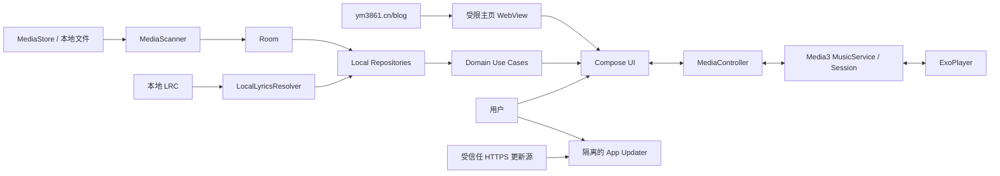
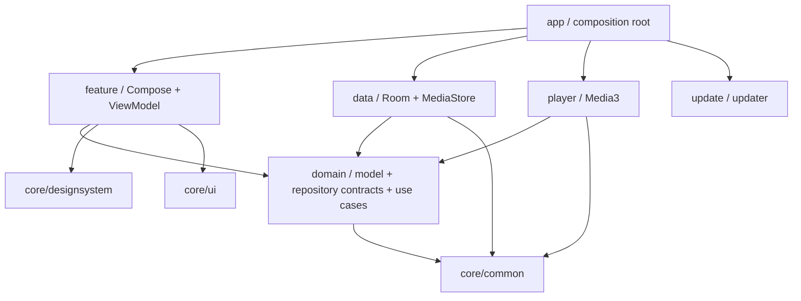
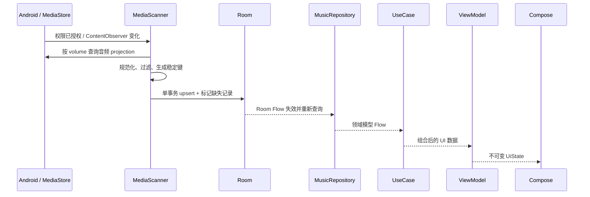
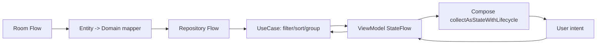
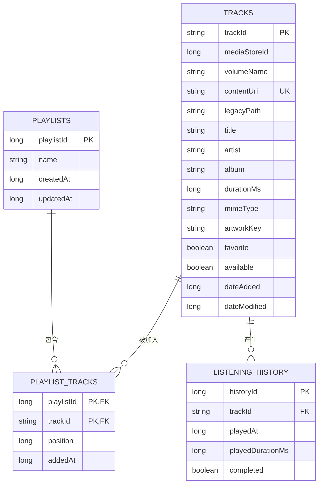
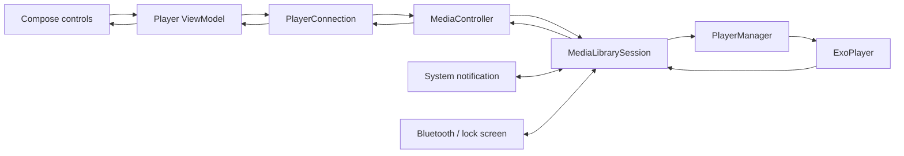

# Liquid Music Android 架构

> 状态：目标架构与实现契约
> 适用范围：原生 Kotlin/Jetpack Compose 重构
> 说明：本文描述最终代码必须遵循的结构和数据流，不表示所有组件已经实现。当前迁移状态与差距以 [Phase 0 审计](./PHASE0_AUDIT.md) 为准。

## 1. 架构目标

Liquid Music Android 是一款 Android 本地音乐播放器。架构服务于以下优先级：

1. 本地曲库和播放稳定可靠；
2. 播放在前台、后台、锁屏、通知和蓝牙控制中保持同一状态；
3. Compose 界面具有 Apple Music 风格的 Liquid Glass、动态专辑视觉和连续动效；
4. 数据迁移、权限拒绝、文件消失和数据库升级不会造成崩溃或静默丢失；
5. 各层可独立测试，音乐能力不依赖网络；
6. 从当前 Flutter 版本覆盖升级时保留合法的本地曲目与播放列表；
7. 运行在 Android 8.0（API 26）至当前目标 SDK 的设备上。

核心技术：

- Kotlin、Coroutines 与 Flow；
- Jetpack Compose、Navigation Compose；
- Hilt；
- Room、DataStore、MediaStore；
- AndroidX Media3 ExoPlayer、MediaLibraryService、MediaLibrarySession；
- Coil 与 Palette，且图片来源仅限本地；
- Material 3 作为基础能力，自定义 Apple 风格设计系统负责最终视觉。

## 2. 产品边界：音乐严格本地

### 2.1 允许的数据来源

音乐域可以读取：

- 用户授权后的 Android MediaStore 音频；
- 用户通过系统文件选择器明确授权或导入的本地音频；
- 从旧 Flutter 版本迁移、仍存在于本应用私有目录的本地文件；
- 音频文件内嵌元数据与内嵌封面；
- 本地 `content://`、`file://`、应用资源和内存中的图片；
- 本地 `.lrc` 歌词；
- Room 中的播放列表、收藏与播放历史；
- DataStore 中的主题、随机、循环等用户设置。

### 2.2 禁止的能力

音乐域不得包含：

- Apple ID、Apple 账户、Apple Music 订阅或 iCloud Music Library；
- Apple Music 在线目录、API、DRM、Radio 服务或 Replay 云统计；
- Subsonic、Navidrome、OpenSubsonic 或其他第三方音乐服务器；
- 在线搜索、在线播放、远端收藏、远端播放列表或远端音乐下载；
- 根据歌曲、专辑或艺人名称联网获取封面、歌词或元数据；
- 将 Browse、Library、Search 或播放器实现为外部音乐内容入口。

Browse 使用本地元数据生成浏览分区，其输入、输出均为设备内数据。

### 2.3 博客首页与应用更新是隔离的网络例外

主页可以在受限 WebView 中访问 `https://ym3861.cn` 的个人博客；应用更新可以访问预配置的 HTTPS 更新清单和 APK。两者都不属于音乐域，不能向 Repository、UseCase、播放器或其他音乐 feature 暴露通用网络能力。博客导航只允许既定 HTTPS 主机留在应用内，外站 HTTP(S) 链接交给系统浏览器，其他 scheme 一律拒绝。

## 3. 系统上下文



系统中存在三个相互隔离的 I/O 边界：

- 音乐 I/O：MediaStore、本地文件、Room、DataStore、Media3；
- 博客 I/O：只服务主页 WebView 的既定 HTTPS 主机；
- 更新 I/O：受信任 HTTPS 主机上的清单与 APK。

任何在线音乐能力都不能借用博客或更新 I/O 边界。

## 4. 分层与依赖方向

采用 Clean Architecture 与 MVVM。依赖始终指向稳定的领域规则：



依赖规则：

- `domain` 不依赖 Compose、Android UI、Room、MediaStore、Media3、Coil 或更新器；
- `data` 实现 domain 仓库接口，不把 Room Entity 或 Cursor 暴露给上层；
- `player` 实现播放控制边界，只有它可以持有 ExoPlayer、MediaSession 和 MediaController 适配代码；
- `feature` 通过 UseCase 获取业务数据，通过播放连接接口发出播放器命令；
- ViewModel 不直接访问 DAO、ContentResolver、ExoPlayer 或 HTTP 客户端；
- Composable 不执行数据库查询、媒体扫描、文件读取或播放器初始化；
- `core/designsystem` 只消费视觉参数，不读取业务仓库；
- `update` 不依赖或实现任何音乐仓库；
- `app` 是装配根，负责 Hilt、Activity、顶层导航和进程级生命周期，不承载业务规则。

禁止形成 `feature -> data`、`domain -> Android framework` 或 `music repository -> updater` 的反向依赖。

## 5. 包结构

原生迁移初期可以使用单一 `:app` Gradle 模块，但源码必须保持以下包边界。只有在编译隔离、团队并行或复用收益明确时才拆分 Gradle 模块。

```text
io.github.admin0330.liquidmusic
├── app
│   ├── LiquidMusicApplication
│   └── MainActivity
├── core
│   ├── common
│   │   ├── coroutine
│   │   ├── result
│   │   ├── time
│   │   └── logging
│   ├── ui
│   │   ├── state
│   │   ├── formatter
│   │   └── component
│   └── designsystem
│       ├── color
│       ├── theme
│       ├── typography
│       ├── motion
│       ├── glass
│       └── artwork
├── data
│   ├── local
│   │   ├── database
│   │   ├── dao
│   │   ├── entity
│   │   └── migration
│   ├── media
│   │   ├── MediaScanner
│   │   ├── MediaStoreObserver
│   │   ├── MetadataReader
│   │   └── LocalLyricsResolver
│   └── repository
├── domain
│   ├── model
│   ├── repository
│   └── usecase
├── player
│   ├── MusicService
│   ├── PlayerManager
│   ├── connection
│   ├── session
│   ├── notification
│   └── queue
├── feature
│   ├── home
│   ├── browse
│   ├── library
│   ├── search
│   ├── player
│   ├── playlist
│   └── settings
├── navigation
│   ├── LiquidMusicNavHost
│   ├── MainDestination
│   └── FloatingGlassTabBar
└── update
    ├── manifest
    ├── download
    ├── verify
    └── install
```

为保持覆盖升级，`applicationId` 继续使用 `io.github.admin0330.real_liquid_glass_demo`。源码包与 `namespace` 可以使用 `io.github.admin0330.liquidmusic`；两者用途不同，不应为了包名美观破坏应用身份。

## 6. 领域模型与仓库契约

领域层模型表达产品事实，不复制平台结构：

- `Track`：稳定 ID、标题、艺人、专辑、时长、可播放 URI、格式、封面引用、收藏与可用状态；
- `AlbumSummary`：按专辑键聚合的封面、艺人、歌曲数和总时长；
- `ArtistSummary`：按艺人键聚合的专辑数、歌曲数与最近播放信息；
- `Playlist` 与 `PlaylistEntry`：用户播放列表及有序曲目关系；
- `ListeningEvent` / `ListeningStats`：最近播放和本地推荐依据；
- `Lyrics` 与 `LyricLine`：解析后的本地歌词时间轴；
- `PlaybackState`：当前媒体、队列、播放状态、位置、缓冲、随机和循环；
- `LibrarySort`、`LibraryLayout`、`ThemeMode` 等值类型。

主要仓库契约：

- `MusicRepository`：观察曲目、专辑、艺人、收藏、搜索结果和可用状态；
- `PlaylistRepository`：完整播放列表 CRUD、添加、移除与重新排序；
- `ListeningHistoryRepository`：记录有效播放、查询最近播放和统计；
- `LyricsRepository`：查找、解析、缓存并观察当前歌曲本地歌词；
- `SettingsRepository`：主题、默认随机、默认循环、资料库布局和排序；
- `LibrarySyncRepository`：触发扫描并观察扫描进度与结果；
- `PlaybackRepository` 或等价播放边界：观察服务播放状态并发送命令。

UseCase 负责组合业务规则，例如：

- `ObserveListenNowSections`；
- `ObserveLibrary`；
- `SearchLocalLibrary`；
- `CreatePlaylist`、`RenamePlaylist`、`DeletePlaylist`；
- `AddTracksToPlaylist`、`RemoveTrackFromPlaylist`、`ReorderPlaylist`；
- `RecordQualifiedPlayback`；
- `RescanLibrary`；
- `ObserveSynchronizedLyrics`。

Browse 的规则必须落在 domain/usecase 中，确保可测试、可解释且不依赖 Composable 的生命周期。博客 URL 白名单属于主页 feature 的独立导航策略，不进入音乐 domain。

## 7. 曲库数据流

### 7.1 扫描与持久化



扫描流程：

1. UI 只请求权限或触发 `RescanLibrary`，不直接操作 ContentResolver；
2. `MediaScanner` 在 I/O dispatcher 查询 MediaStore；
3. Android 13+ 使用 `READ_MEDIA_AUDIO`，API 26–32 使用相应的旧存储读取权限；
4. 查询只投影需要列，按 volume 分批读取，避免在主线程构造大对象；
5. 每条记录规范化为数据层 DTO，验证 URI、duration、mime/扩展名与可读性；
6. 使用 `volumeName + MediaStore _ID` 构造稳定媒体键，并保存 `content://` URI；
7. 在 Room 事务中 upsert 扫描结果，未出现的旧 MediaStore 记录标为 unavailable 或按策略清理；
8. Room Flow 驱动 Repository 和 UI 更新；
9. `ContentObserver` 进行去抖后触发增量或全量一致性扫描；
10. 扫描失败以类型化错误返回，旧曲库快照仍可展示，不用空列表覆盖有效数据。

`MediaStore.DATA` 不能作为唯一身份或播放依据。能够使用 `content://` URI 时不依赖裸文件路径；旧私有文件通过单独的 legacy URI/路径适配器读取。

### 7.2 查询到界面



规则：

- Room 是本地音乐元数据和用户关系的持久化真源；
- UI 展示的专辑、艺人、搜索和排序由 SQL 投影或 domain 组合生成，不维护另一份可变缓存；
- ViewModel 对外暴露只读 `StateFlow<UiState>`；
- 界面事件使用明确的 intent/function，不通过可变 model 双向绑定；
- 短暂 UI 状态，如展开、滚动位置和 snackbar，不写入音乐数据库；
- 用户设置写入 DataStore，播放事实由 Media3 服务维护。

### 7.3 搜索一致性

搜索输入通过 `StateFlow`、`debounce` 和 `flatMapLatest` 进入 Repository 查询。新查询会取消旧查询，旧结果不能覆盖新关键字。歌曲、专辑、艺人和播放列表的结果带明确类型，空输入与无匹配分别建模。

## 8. Room schema 与关系

### 8.1 关系图



### 8.2 约束与索引

- `tracks.trackId` 是应用稳定键；MediaStore 与 legacy 使用不同命名空间；
- `contentUri` 在非空时唯一，避免同一 MediaStore 项重复导入；
- `playlist_tracks` 使用 `(playlistId, trackId)` 复合主键，并对 `(playlistId, position)` 建索引；
- 删除播放列表级联删除其关系，不删除曲目；
- 曲目消失时优先保留 unavailable 记录，使播放列表可以展示“文件不可用”并等待重新关联；
- 删除不可恢复曲目前，先处理播放列表关系和历史保留策略；
- `listening_history` 对 `playedAt`、`trackId + playedAt` 建索引，并按保留策略定期收敛；
- 收藏作为本地用户属性，不应被 MediaStore 重扫覆盖；
- 专辑和艺人优先由 Track 查询投影生成，只有在测量证明必要时才引入独立实体；
- 播放列表写入、位置移动和批量添加必须使用 Room 事务。

### 8.3 数据库迁移政策

- 开启 Room schema 导出并纳入版本控制；
- 每次 schema 变化提供显式 `Migration`；
- Release 禁止 destructive fallback；
- 使用 `MigrationTestHelper` 覆盖所有已发布 schema 到当前 schema 的路径；
- 迁移失败时返回可诊断错误，不删除用户库；
- 长耗时的数据修复分批执行，并提供扫描/修复状态，不阻塞主线程。

## 9. Media3 播放架构

### 9.1 播放状态真源

Media3 服务中的 ExoPlayer 与 MediaLibrarySession 是播放状态的唯一真源。ViewModel、Composable、通知和迷你播放器都不能各自维护独立的“正在播放”事实。



职责：

- `MusicService : MediaLibraryService` 管理播放器与 Session 生命周期；
- `PlayerManager` 将领域曲目/队列转换为 Media3 `MediaItem`，执行恢复、队列和错误策略；
- `MediaLibrarySession` 响应系统浏览、播放命令和自定义命令；
- `PlayerConnection` 在 UI 进程中建立 `MediaController`，把回调转换为冷启动安全的 `StateFlow<PlaybackState>`；
- `PlayerViewModel` 将服务状态映射为播放页、迷你播放器和歌词所需 UI 状态；
- Notification、锁屏与蓝牙通过 Session 读取同一状态；
- 播放位置的高频更新按可见性和需要节流，不能导致整个应用每帧重组。

### 9.2 命令路径

所有播放命令经 MediaController/Session 发送：

- play、pause、seek；
- next、previous；
- set queue、add/remove/reorder queue；
- shuffle；
- repeat off/one/all；
- 从某首歌曲、专辑或播放列表开始播放。

UI 不直接调用 ExoPlayer。服务验证媒体 ID 并从 Repository 解析可播放 URI；文件不可用时跳过或暂停并发出可恢复错误，而不是把空 URI 交给播放器。

### 9.3 生命周期与系统行为

- 服务声明 media playback foreground service type；
- 播放开始后按系统规则进入前台并展示媒体通知；
- 处理音频焦点、耳机拔出、蓝牙断开和 noisy intent；
- 对 API 33+ 处理通知权限，但通知权限拒绝不能让应用崩溃；
- Session metadata 包含本地标题、艺人、专辑和安全缩放后的封面；
- Service 销毁时释放 ExoPlayer、Session、回调和协程；
- 队列恢复必须校验每个媒体 ID 仍可用；
- 播放历史在达到有效播放阈值后写入，不能在每次进度 tick 写数据库。

## 10. ViewModel、Compose 与导航

每个 feature 对外提供 route、screen、ViewModel 和不可变 UI state。典型状态：

```text
sealed interface LibraryUiState
├── Loading(previousContent?)
├── Content(items, layout, sort, permissionState)
├── Empty(action)
└── RecoverableError(previousContent?, message, action)
```

UI 原则：

- 使用 `collectAsStateWithLifecycle` 收集 StateFlow；
- 列表项具有稳定 key，避免排序或刷新导致错误复用；
- 导航参数只传稳定 ID，不传大对象、Bitmap 或 Entity；
- 迷你播放器放在顶层 scaffold，与四栏导航共享明确的 content inset；
- 全屏播放页通过共享元素标识连接迷你封面与主封面，但实际播放状态仍来自服务；
- 页面过渡、颜色过渡和玻璃出现使用统一 motion token；
- 动效只改变 transform、opacity 或经过测量的材质参数，避免每帧改变布局结构；
- 每个按钮有明确点击、按压和禁用状态，触摸目标不小于 44dp；
- 空曲库、拒绝权限、缺少封面、无歌词和播放失败都有完成的界面状态。

四个顶层目的地固定为 Home、Browse、Library 和 Search。Home 内嵌个人博客并保留设置入口；博客 WebView、Dock 和迷你播放器共享明确的 content inset。

## 11. Liquid Glass 与动态视觉边界

`core/designsystem` 提供统一 token 和 `LiquidGlassSurface`。该组件至少接收：

- `blurRadius`；
- `opacity`；
- `cornerRadius`；
- `tintColor`；
- `elevation`；
- 可选的动态光照状态。

设计系统内部负责 API 能力差异，业务 feature 不判断系统版本来选择玻璃实现。封面视觉流程为：

```text
本地封面 -> 尺寸受控的解码 -> Palette 提取 -> 缓存色板
         -> 对比度修正 -> 背景渐变状态 -> 动画过渡 -> 玻璃 tint
```

Palette 计算和位图解码在后台执行并缓存。无封面时使用稳定的应用色板。API 31+ 与 API 26–30 可以使用不同渲染后端，但都必须保持内容可读、触摸稳定和布局一致；低版本降级不能退化成没有层次的纯透明背景。

## 12. Hilt 装配

Hilt 的作用是装配实现，不把依赖注入注解渗透到领域规则中。

### 12.1 `SingletonComponent`

进程级依赖：

- Room Database 与 DAO；
- ContentResolver/MediaStore gateway；
- Music、Playlist、History、Lyrics、Settings repository 实现；
- MediaScanner 与 MediaStoreObserver；
- DataStore；
- 应用级 dispatchers、clock 和脱敏 logger；
- PlayerConnection；
- 更新器的受限配置、清单解析器与下载验证器。

### 12.2 Service 装配

`MusicService` 使用 `@AndroidEntryPoint`。服务注入：

- ExoPlayer provider/factory；
- PlayerManager 依赖；
- MusicRepository；
- MediaItem mapper；
- Session callback factory；
- Playback history recorder。

实际 ExoPlayer 与 MediaLibrarySession 由 Service 创建并拥有，在 `onDestroy` 释放。不能让 Activity 拥有播放器，也不能让一个全局对象在 Service 销毁后继续引用旧 Context。

### 12.3 ViewModel 装配

feature ViewModel 使用 `@HiltViewModel` 注入 UseCase、SavedStateHandle 和播放连接接口。ViewModel 不注入 DAO、Database、ContentResolver、Service 实例或 ExoPlayer。

### 12.4 Qualifier

至少区分：

- Main / IO / Default CoroutineDispatcher；
- application context；
- 更新器专用网络客户端与任何未来非网络客户端；
- 时间来源，便于历史记录和迁移测试。

## 13. 错误模型

底层异常在边界处转换为稳定的应用错误，不直接把 Exception 文本暴露给 UI。

```text
AppError
├── PermissionDenied(kind, canRequestAgain)
├── MediaUnavailable(trackId, reason)
├── UnsupportedFormat(trackId, format)
├── PlaybackFailure(trackId?, recoverability)
├── DatabaseFailure(operation, recoverability)
├── MigrationFailure(stage, recoverability)
├── LyricsFailure(trackId, reason)
├── UpdateFailure(stage, reason)
└── UnknownFailure(correlationId)
```

规则：

- data/player/update 层保存原始异常用于脱敏日志，并映射为领域错误；
- ViewModel 把领域错误转换成用户可理解的消息和恢复动作；
- 可恢复错误保留上一份有效内容，不用空列表覆盖；
- 一次性 UI 事件使用受生命周期约束的事件通道或状态消费机制；
- 取消协程不是错误，不记录为失败；
- 错误日志不包含密码、完整服务器 URL、用户私有绝对路径或歌词全文；
- 播放队列遇到单个坏文件时按策略跳过并通知，不能让整个 Service 崩溃；
- 数据库迁移失败禁止自动清库。

## 14. 旧 Flutter 数据的幂等迁移

覆盖安装原生版本时，同一 `applicationId` 下的 SharedPreferences 和应用私有文件仍可能存在。迁移器在 Room 可用后、普通曲库展示前运行一次，并允许安全重试。

### 14.1 旧数据映射

| 旧键 | 处理方式 |
| --- | --- |
| `local_music_library_v2` | 验证私有音频/封面存在后映射为 Track；来源标为 legacy private |
| `personal_playlists_v2` | 曲目映射成功后事务导入 Playlist 与有序关系 |
| `offline_tracks_v2` | 只保留确实存在、可作为本地文件读取的副本；移除远端 URL 与服务器关系 |
| `subsonic_server`、`subsonic_user` | 不迁移并清理 |
| `subsonic_password` | 不迁移；安全清理且不写日志 |
| `update_manifest_url_v1` | 仅当 HTTPS 且命中受信任主机策略时迁移 |

### 14.2 迁移步骤

1. 检查迁移完成标记；
2. 读取实际 Flutter preference 文件与可能存在的 `flutter.` 键前缀；
3. 解析为版本化迁移 DTO；
4. 对路径做规范化、私有目录边界、存在性、可读性和媒体类型检查；
5. 为 legacy 文件生成独立命名空间的稳定 ID；
6. 以 URI、路径、大小、时长和修改时间与 MediaStore 记录去重；
7. 在同一 Room 事务内写入曲目、收藏、播放列表和顺序；
8. 单条损坏记录隔离并计数，不中断其余合法记录；
9. 事务成功后写入迁移完成标记；
10. 重复启动再次执行时不得产生重复曲目、播放列表或关系；
11. 远端凭据清理与音乐数据导入分开记录，凭据清理失败也不能把密码输出到日志；
12. 旧 JSON 在确认成功或经过安全延迟窗口后清理，音频文件不做未经用户确认的破坏性删除。

当前 Flutter 版本没有可靠的完整播放历史来源，因此迁移后从首次有效播放开始积累历史，不能用曲库顺序伪造 Recently Played。

## 15. 更新器网络隔离

更新器由四个边界组成：

1. `UpdateManifestSource`：只读取预配置 HTTPS 清单；
2. `ApkDownloader`：写入应用更新缓存的临时文件；
3. `ApkVerifier`：校验版本、文件大小、SHA-256、包名与签名兼容性；
4. `ApkInstaller`：在用户操作后通过 FileProvider/Package Installer 进入系统安装流程。

安全约束：

- 生产清单移除全局 `usesCleartextTraffic="true"`；
- 客户端不接受任意 URL，不执行重定向到非白名单主机；
- 阿里云可作为国内主更新源，GitHub Release 可作为显式备用或发布存档；
- 清单签名或 HTTPS 信任、APK SHA-256 和大小校验至少形成两层完整性保障；
- 下载先写 `.part`，完成校验后原子改名；
- 本地已存在同版本且校验通过的 APK 时直接复用；
- 失败下载不伪装成可安装包；
- `REQUEST_INSTALL_PACKAGES` 只在用户确认安装时处理；
- 更新器不暴露通用 HTTP client 给音乐层；
- 更新日志不记录带凭据的 URL 或完整设备路径。

依赖结构必须保证删除整个 `update` 包后，本地曲库、播放、歌词、Browse 和设置仍可正常工作；删除博客主页实现也不能影响任何音乐能力。

## 16. 并发、性能与资源管理

- Room Flow 和 MediaStore I/O 在受控 dispatcher 运行；
- 单次扫描使用 Mutex 或任务合并，避免多个全量扫描并发写库；
- ContentObserver 事件去抖，应用前台恢复不重复启动相同扫描；
- Repository 使用 `distinctUntilChanged` 与结构化查询减少无效发射；
- ViewModel 使用 `stateIn`/`shareIn` 时明确作用域和停止策略；
- 封面使用尺寸受控的 Coil 请求，列表不加载播放器所需的全分辨率位图；
- Palette 按 artwork key 缓存，封面未变化时不重复提取；
- 玻璃背板降采样并裁剪到可见区域，不持续模糊整张高分辨率页面；
- 歌词只更新当前可见范围和当前行，高频播放位置流不驱动无关页面重组；
- Lazy 列表使用稳定 key 和不可变模型；
- Service、Session、Player、Controller、ContentObserver 和协程均有明确释放点；
- 性能以 Macrobenchmark、JankStats 或 Perfetto 证据判断，不以主观观感代替测量。

## 17. 测试策略

### 17.1 单元测试

- domain UseCase：排序、分组、搜索、收藏与播放历史；
- 博客导航策略：主机白名单、HTTPS 限制、外链与危险 scheme 隔离；
- LRC parser：多时间戳、offset、空行、损坏输入、seek 定位；
- Entity/Domain/MediaItem mapper；
- 错误映射与恢复策略；
- 更新清单解析、版本比较、SHA-256 与缓存复用；
- Flutter 迁移 DTO、去重和幂等性。

### 17.2 数据层测试

- Room DAO 查询、索引、外键和事务；
- 播放列表创建、重命名、删除、添加、移除和重排；
- 每个已发布 schema 到当前 schema 的 MigrationTestHelper 测试；
- MediaStore gateway 使用 fake ContentResolver/契约测试覆盖新增、修改、删除、重复与权限拒绝；
- 文件丢失后 unavailable 状态和重新关联。

### 17.3 播放测试

- Media3 Session command 与队列映射；
- 播放、暂停、seek、上下首、随机、循环；
- 无效 URI、文件删除、不支持格式和解码错误；
- 通知、锁屏、蓝牙/耳机控制和音频焦点；
- Service 重建、Activity 重建与后台恢复；
- 实机样本验证 MP3、FLAC、WAV、M4A、OGG。

### 17.4 UI 与导航测试

- 四个主 Tab 的导航与状态恢复；
- 博客主页加载、后退、刷新、错误恢复和 WebView 状态恢复；
- 底部内容 inset，确保导航和迷你播放器不覆盖内容；
- Library 列表/网格和四种排序；
- 搜索取消旧请求与空状态；
- 迷你播放器到全屏播放器共享过渡；
- 歌词切换、滚动、高亮与播放器控制空间；
- Light/Dark/System 主题和大字体；
- 权限拒绝、空曲库、缺封面、无歌词、播放失败状态；
- TalkBack 语义、焦点顺序和不小于 44dp 的触摸目标。

### 17.5 升级、安全与发布测试

- 从当前正式 Flutter APK 准备含曲目、收藏、播放列表和更新设置的真实升级夹具；
- 使用同一应用 ID 与正式证书覆盖安装原生候选版本；
- 验证迁移重复启动不重复写入；
- 通过网络代理证明音乐功能不访问外部服务；
- 验证更新器拒绝错误哈希、错误大小、错误包名、错误签名和非白名单重定向；
- 从干净克隆执行 `clean`、`assembleDebug`、`assembleRelease`；
- 使用 `apksigner` 验证最终 APK 证书与已有发布证书一致。

### 17.6 性能测试

关键基准：

- 冷启动到可交互；
- 大曲库初次扫描与增量扫描；
- Library 长列表滚动；
- 连续 Tab 切换；
- 迷你播放器展开/返回；
- 歌词自动滚动与 seek；
- 连续切歌、封面解码、Palette 和动态背景过渡；
- 后台长时间播放和多次 Activity 重建。

60 Hz 设备以 16.67 ms 帧预算为参考，记录 P50/P90/P95、jank、CPU、GPU 与内存。未达到门槛时应优化采样、缓存、查询和重组范围，不能通过删除必要交互来掩盖问题。

## 18. 架构不变量

以下条件在任何实现阶段都必须成立：

1. 音乐播放和曲库浏览不依赖网络；
2. Room 是本地音乐元数据与用户关系的持久化真源；
3. Media3 Service/Session 是当前播放状态的唯一真源；
4. UI 不直接访问 DAO、ContentResolver 或 ExoPlayer；
5. 远端音乐源、在线歌词和在线封面不进入代码路径；
6. 更新器网络与音乐域在依赖和运行时均隔离；
7. 数据库升级不使用破坏性回退；
8. 旧 Flutter 数据迁移幂等，单条坏数据不会破坏整批合法数据；
9. 覆盖升级继续使用既有 `applicationId`、正式签名与递增 `versionCode`；
10. Composable 只渲染状态并发送意图，不充当业务或播放状态容器；
11. 不提交来源不明的完整歌词、密钥、keystore 或用户私有数据；
12. 功能完成以构建、自动化、实机与性能证据为准。

## 19. 实施完成判定

本架构只有在以下事实同时成立时才可视为落地：

- 包和依赖方向通过静态检查与代码审查；
- MediaStore、Room、Repository、UseCase、ViewModel、Compose 数据流完整贯通真实曲库；
- Media3 Service/Session 驱动通知、锁屏、蓝牙、迷你播放器和全屏播放器的同一状态；
- 播放列表、历史、歌词、主题和旧数据迁移具有自动化测试；
- 更新器无法被音乐功能调用，且安装前完成完整性与身份校验；
- API 26 至目标 SDK 的关键权限、播放和渲染路径通过验证；
- 干净克隆可以完成 Debug 与 Release 构建；
- Phase 0 审计定义的 11 项产品验收均有可复现证据。
